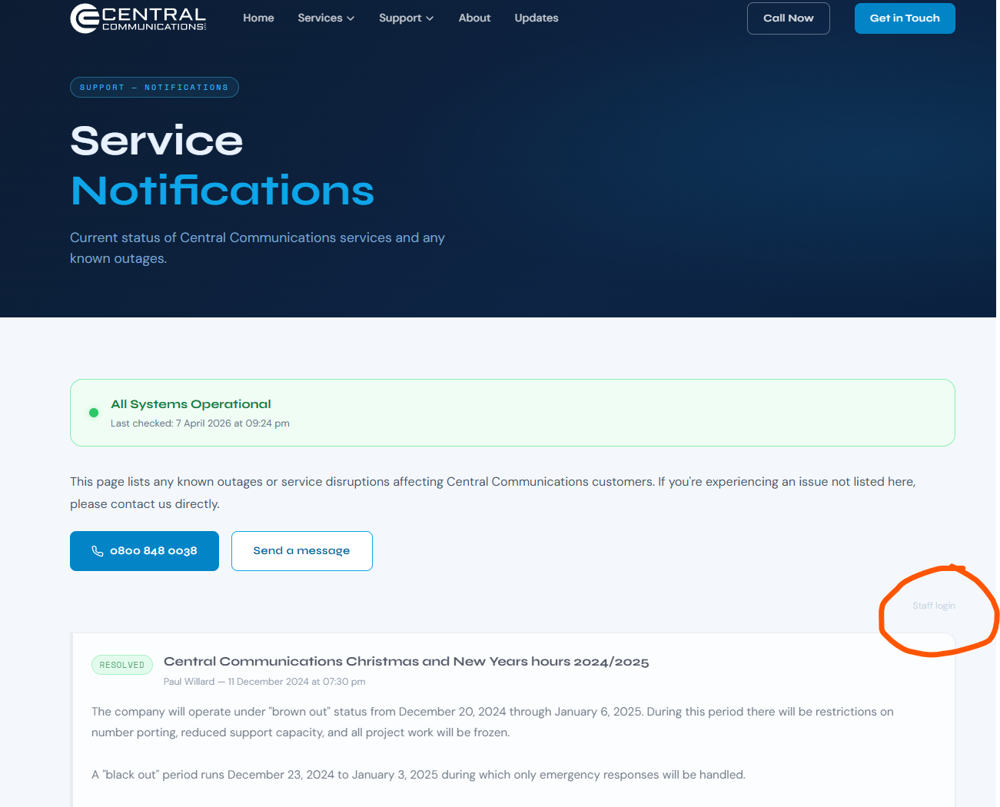
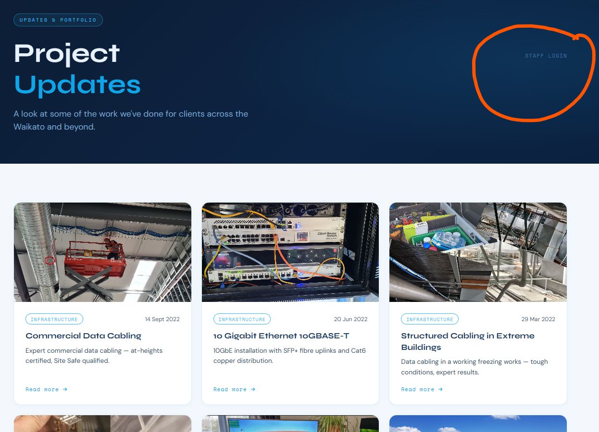

# Screenshots

Visual walkthroughs of the Notifications system and Updates CMS staff interface.

**Navigation:** [Main README](../../README.md) · [Developer docs](../README.md) · [Changelog](../CHANGELOG.md)

---

## Contents

- [Notifications system](#notifications-system)
  - [Public notifications page](#1-public-notifications-page)
  - [Staff login modal (notifications)](#2-staff-login-modal-notifications)
  - [Edit notification form](#3-edit-notification-form)
  - [Notification detail with comment field](#4-notification-detail-with-comment-field)
- [Updates CMS](#updates-cms)
  - [Public updates index](#5-public-updates-index)
  - [Staff login modal (updates)](#6-staff-login-modal-updates)
  - [Logged-in view — New Update button](#7-logged-in-view--new-update-button)
  - [Rich-text post editor](#8-rich-text-post-editor)
  - [Post page — Edit / Delete / Logout controls](#9-post-page--edit--delete--logout-controls)

---

## Notifications system

The Notifications system is a live service status feed. It is driven by `notifications.json` on the server and updated by staff through the in-browser editor. Visitors see the current state of all CCL services; staff can log in without leaving the page to create, edit, or delete entries.

---

### 1. Public notifications page

The public `/notifications` page. The green **All Systems Operational** banner is shown when no active issues exist. Historical or resolved notifications appear below in a chronological feed; items beyond the first few load via infinite scroll so the initial page stays fast. The **Staff Login** link sits quietly in the top-right corner of the page — it is visible but unobtrusive.

> **How it works:** The page loads `notifications.json` via a PHP API call at render time (on the client, post-load). Active issues are always rendered first; resolved items are paginated.

---

### 2. Staff login modal (notifications)

Clicking **Staff Login** opens this modal overlay — the underlying page stays visible but dimmed. Staff enter their username and password; the PHP API validates the credentials against a bcrypt hash stored in config. On success the session is set and the page gains write controls without a full reload.

> **Security note:** Credentials are never stored in the browser. Sessions are server-side PHP sessions. Passwords are hashed with `password_hash()` / bcrypt.

---

### 3. Edit notification form

The edit view for an existing notification. Fields:

| Field | Notes |
|---|---|
| **Status** | Dropdown: `info`, `warning`, `outage`, `resolved` |
| **Title** | Short summary shown as the notification heading |
| **Content** | Free-text body; supports line breaks |

Clicking **Save Notification** sends the updated record to the PHP API, which rewrites `notifications.json` atomically. The change is live immediately.

---

### 4. Notification detail with comment field

When a staff member is logged in and views an individual notification, the full card is shown with:

- The notification body text
- **Edit** and **Delete** buttons to manage the entry
- An **Add update / workaround / resolution note** text field for appending follow-up information to the notification without replacing the original body

This lets staff post incremental status updates (e.g. "Engineers on-site — ETA 2 hours") to an active outage card as the situation develops.

---

## Updates CMS

The Updates section is a project portfolio — case studies and work highlights published by staff. Each post has a title, excerpt, rich-text body (with inline images and YouTube embeds), a featured image, tags/categories, author, and date. The CMS is entirely in-browser using a TipTap rich-text editor; no separate admin panel or login page is required.

---

### 5. Public updates index

The `/updates` page shows all published posts as cards — featured image, tag, date, title, and excerpt. Cards are ordered newest-first. The **Staff Login** link (circled) sits in the top-right of the hero section; it is only visible on this page and on individual post pages, keeping the CMS access point out of the main navigation.

---

### 6. Staff login modal (updates)

The same bcrypt-authenticated login modal used on the Notifications page — the UI is consistent across both systems. After a successful login the page refreshes its state and reveals the CMS controls.

---

### 7. Logged-in view — New Update button

Once authenticated, a **+ New Update** button (circled) and a **Logout** link appear in the hero. Clicking **+ New Update** opens the full post editor (see next screenshot). The public post grid below is unchanged — visitors and staff see the same content; only the controls differ.

---

### 8. Rich-text post editor

The full post editor used for both creating and editing posts. Left sidebar fields:

| Field | Notes |
|---|---|
| **Title** | Post heading, also used to generate the URL slug |
| **Excerpt** | Short summary shown on the index card |
| **Date** | Publication date (defaults to today) |
| **Author** | Free text, shown on the post page |
| **Categories** | Comma-separated tags displayed on index and post pages |
| **Featured image** | Upload or URL; shown as the card thumbnail and post hero |

The right panel is a full TipTap rich-text editor supporting bold, italic, headings, bullet lists, links, inline images (uploaded to the server), and YouTube video embeds. **Save Changes** sends the complete post payload to the PHP API, which updates `updates.json` on the server immediately.

---

### 9. Post page — Edit / Delete / Logout controls

When a staff member is logged in and views any individual post, three buttons (circled) appear at the bottom of the page:

- **Edit Post** — opens the rich-text editor pre-populated with the current post data
- **Delete Post** — prompts for confirmation, then removes the post from `updates.json` and deletes any uploaded images associated with it
- **Logout** — ends the PHP session and removes the CMS controls from the page

These controls are injected client-side after session validation; they are never present in the static HTML served to regular visitors.
